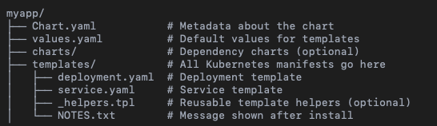

[Main](../README.md)
---

# Kubernetes Helm Lab: Chart Structure and Templating Logic

This lab focuses purely on practice. Students will create and analyze Helm charts from scratch, exploring structure, templates, values, and commands.

⸻

🎯 Objectives
* Understand Helm chart folder structure
* Use templates and values.yaml
* Learn basic Helm commands for install, upgrade, inspect, and delete
* Dive into Chart.yaml metadata
* Edit common template files (Deployment, Service, NOTES.txt)

⸻

## 🛠 Step 1: Create a New Helm Chart

```bash
helm create myapp
cd myapp
```
✅ Explanation: This generates a sample chart with templates/, values.yaml, and boilerplate files.

Explore the structure:
```bash
ls -R
```

⸻

## 📂 Step 2: Chart Folder Structure




⸻

## 🧾 Step 3: Customize Chart Metadata

Edit Chart.yaml:
```yaml
apiVersion: v2
name: myapp
version: 0.1.0
appVersion: "1.0"
description: A simple Helm chart for deploying NGINX
keywords:
  - web
  - nginx
type: application
maintainers:
  - name: DevOps Student
    email: student@example.com
```
✅ Explanation:
* name: name of the chart
* version: Helm chart version (not the app version)
* appVersion: container image version
* type: application or library
* maintainers: optional metadata

⸻

## 🧾 Step 4: Edit values.yaml
```yaml
replicaCount: 2
image:
  repository: nginx
  pullPolicy: IfNotPresent
  tag: "1.25"
service:
  type: ClusterIP
  port: 80
```
✅ Explanation:
* These are referenced in the templates as .Values.<key>

⸻

## 📄 Step 5: Modify templates/deployment.yaml
```yaml
apiVersion: apps/v1
kind: Deployment
metadata:
  name: {{ include "myapp.fullname" . }}
  labels:
    app: {{ include "myapp.name" . }}
spec:
  replicas: {{ .Values.replicaCount }}
  selector:
    matchLabels:
      app: {{ include "myapp.name" . }}
  template:
    metadata:
      labels:
        app: {{ include "myapp.name" . }}
    spec:
      containers:
      - name: {{ .Chart.Name }}
        image: "{{ .Values.image.repository }}:{{ .Values.image.tag }}"
        imagePullPolicy: {{ .Values.image.pullPolicy }}
        ports:
        - containerPort: {{ .Values.service.port }}
```
✅ Explanation:
* {{ .Values.replicaCount }}: pulls from values.yaml
* include helper uses logic from _helpers.tpl
* {{ .Chart.Name }} references the chart name directly

⸻

## 📄 Step 6: Modify templates/service.yaml
```yaml
apiVersion: v1
kind: Service
metadata:
  name: {{ include "myapp.fullname" . }}
spec:
  type: {{ .Values.service.type }}
  selector:
    app: {{ include "myapp.name" . }}
  ports:
    - protocol: TCP
      port: {{ .Values.service.port }}
      targetPort: {{ .Values.service.port }}
```
✅ Explanation:
* This exposes the NGINX app via a service using values

⸻

## 📝 Step 7: Modify templates/NOTES.txt

1. Get the application URL:
```bash
  export POD_NAME=$(kubectl get pods --namespace {{ .Release.Namespace }} -l "app={{ include "myapp.name" . }}" -o jsonpath="{.items[0].metadata.name}")
  echo "Visit http://127.0.0.1:8080 to access the app"
  kubectl port-forward $POD_NAME 8080:80
```
✅ Explanation:
* This message is shown after helm install

⸻

## 🔍 Step 8: Preview Rendered YAML
```bash
helm template myapp .
```
✅ Explanation: Shows raw Kubernetes YAML from templates and values

⸻

## 🚀 Step 9: Install to Kubernetes
```bash
helm install myapp . -n helm-lab --create-namespace
```
Verify:
```bash
helm list -n helm-lab
kubectl get all -n helm-lab
```

⸻

## 🔄 Step 10: Upgrade with New Values

Edit values.yaml:
```yaml
replicaCount: 3
```
Apply:
```bash
helm upgrade myapp . -n helm-lab
```
⸻

## 🧪 Step 11: Dry Run + Debug
```bash
helm upgrade --install myapp . -n helm-lab --dry-run --debug
```
✅ See rendered templates and test without applying.

⸻

## 🗑️ Step 12: Uninstall and Cleanup
```bash
helm uninstall myapp -n helm-lab
kubectl delete ns helm-lab
```

⸻

## ✅ Summary

You practiced:
* Helm chart structure and metadata
* Template editing: Deployment, Service, NOTES
* Referencing values in templates
* Using key Helm commands: install, upgrade, template, status, uninstall

🎯 This prepares you for deeper Helm templating and logic.

[Main](../README.md)
---